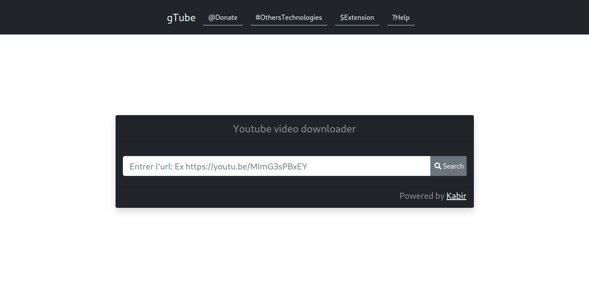

# gTube

A small web application for downloading youtube videos in various formats that works a bit like the famous savefrom.net


## Installation

Install my-project with GitHub

### Make sure you already have Python3 and Django>=3.2.9 installed on your machine

```bash
  git clone https://github.com/BlakvGhost/gTube.git

```
Unzipp the folder and
```bash
    cd gTube-main
```
Install the project requirements
```bash
    pip3 install -r requirements.txt
```
start now the server

```bash
    python3 manage.py runserver
```
    
## Screenshots



## Tech Stack

**Client:** HTML5, CSS3, JQuery

**Server:** Django, SQLite

## License

[](https://choosealicense.com/licenses/mit/)
[](https://opensource.org/licenses/)
[](http://www.gnu.org/licenses/agpl-3.0)
